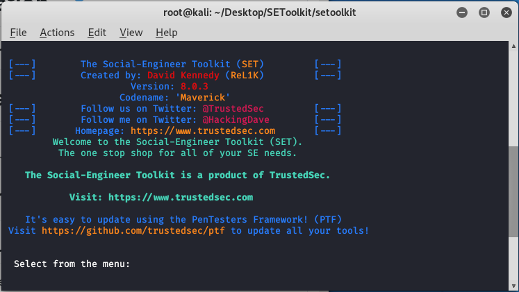

# **Criando PHISHING com Kali Linux**🐲🎣

O desafio proposta pela plataforma DIO foi capturar dados de uma vitíma através de um phishing. Todas as ações executadas nesse desafio foram para meios educativos e ninguem foi afetado com devidos atos.

## Requisitos

- Possuir uma VM
- Ter o Kali Linux ou SO que possua compatibilidade com a ferramenta usada.
- Ter o toolkit

## **Instruções**

- [1] - Abra o Terminal e se registre como super Usuario
- [2] - Execute o comando ``setoolkit``
- [3] - Escolhe o item 1 que trata ataques do tipo engenharia social
- [4] - Escolhe o item 3 que usa o ataque de coleta de dados através de um web site
- [5] - Escolhe o item 2 para clonar um site já existente
- [6] - Use a url ``http://sitedesuaescolha.com``

## **Etapa de teste**
A vítima tera que acessar o endereço dado pelo toolkit, abrir o mesmo em um navegador, após isso será aberto uma página com a mesma interface do site original. Quando os campos forem preenchidos a vitíma tera seus dados vazados no terminal do atancante.

## **Imagens** 
Interface do toolkit
